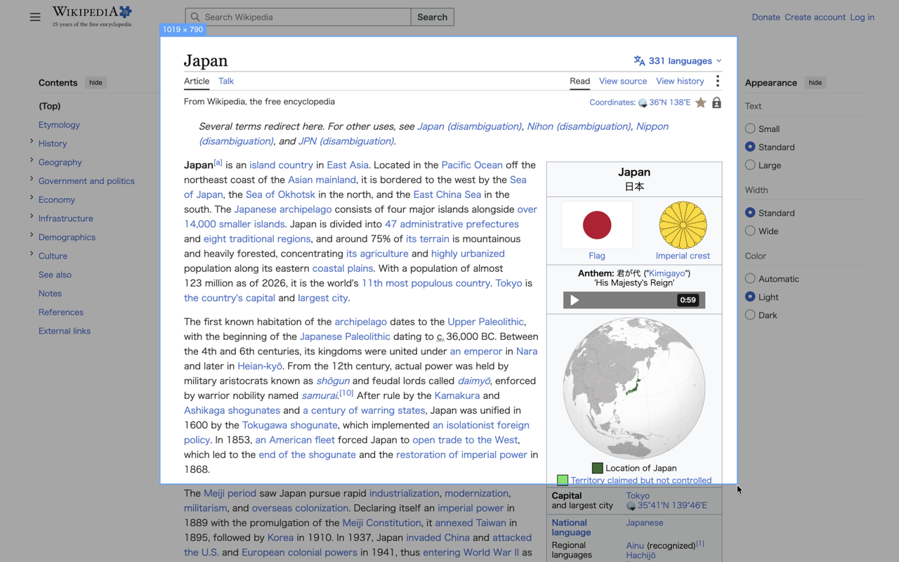
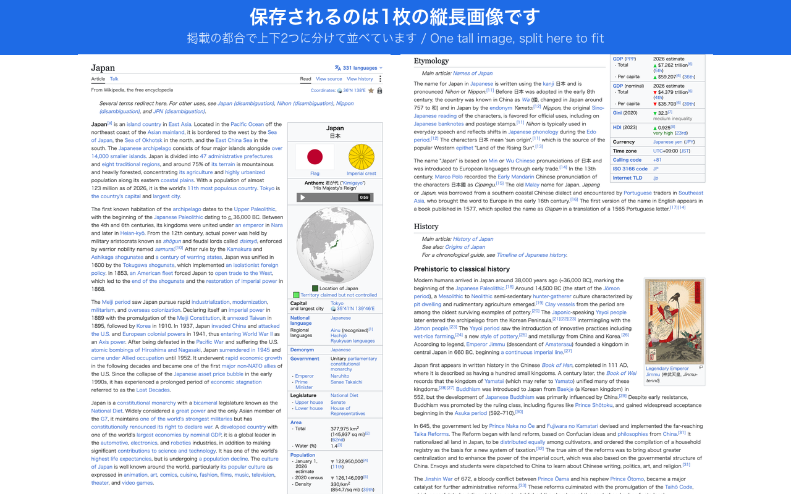

<div align="center">


# ココソコ - Koko Soko

**ココからソコまで、範囲を指定してスクロールごとスクショできるChrome拡張機能**

[](https://chromewebstore.google.com/detail/EXTENSION_ID)
[](./LICENSE)

🇯🇵 [日本語](#日本語) | 🇺🇸 [English](#english)

</div>

<!--
公開後にやること:
1. 上のバッジの EXTENSION_ID を、実際のChromeウェブストアの拡張機能IDに差し替える
2. 下のデモGIF・スクリーンショットのコメントアウトを解除する
   - assets/demo/demo.gif
   - assets/screenshots/screenshot-01.png 〜 screenshot-05.png
-->

---

## 日本語

### これは何？

「ココソコ」は、Webページ上の好きな範囲をドラッグで選択すると、その範囲をスクロールしながら継ぎ目なく1枚のスクリーンショットに合成してくれるChrome拡張機能です。ページ全体をまるごと1枚で撮影する「Full Page」モードも使えます。

画面に収まりきらない長い表、記事全文、チャットのやり取りなどを、何枚もスクショを撮って後からつなぎ合わせる手間なしに、1枚のPNGとして保存できます。

<!--
#### デモ


-->

### 主な特徴

- **範囲指定 × スクロール撮影** — 選んだ範囲が画面の外まで続いていても、自動でスクロールしながら撮影して1枚に合成します
- **完全にローカルで完結** — 撮影も画像の合成もブラウザ内で行います。画像やページの内容が外部サーバーに送信されることは一切ありません
- **追従ヘッダーを自動で退避** — 固定表示のヘッダーやサイドバーは撮影中だけ一時的に非表示にするので、合成画像に同じヘッダーが何度も写り込みません
- **最小限の権限** — 要求するのは `activeTab` と `scripting` のみ。訪問するすべてのサイトを常時読み書きできるような強い権限は要求しません

<!--
#### スクリーンショット

| 範囲を選択 | 撮影中 | 保存された画像 |
|---|---|---|
|  |  |  |
-->

### 使い方

1. 拡張機能のアイコンをクリックする
2. 出てきたポップアップで「Full Page」（ページ全体）か「Select Area」（範囲を選ぶ）を選ぶ
   - **Full Page**: そのままページの先頭から末尾まで自動でスクロールしながら撮影します
   - **Select Area**: ドラッグで撮影したい範囲を選択し、指を離すと撮影が始まります（画面の端に近づくと自動スクロールするので、画面外まで範囲を広げられます）
3. 撮影が終わるとPNGファイルとして自動的にダウンロードされます

範囲選択中に `Esc` キーを押すとキャンセルできます（撮影が始まった後はキャンセルできません）。

### インストール

#### Chrome ウェブストアから（推奨）

[Chrome ウェブストアのページ](https://chromewebstore.google.com/detail/EXTENSION_ID)を開き、「Chromeに追加」をクリックしてください。

#### ソースからビルドする（開発者向け）

```bash
git clone https://github.com/enknot96/kokosoko.git
cd kokosoko
pnpm install
pnpm build
```

1. Chromeで `chrome://extensions` を開く
2. 右上の「デベロッパーモード」をONにする
3. 「パッケージ化されていない拡張機能を読み込む」を選択
4. 生成された `dist` フォルダを選択する

### 既知の制限

以下はChrome側の仕様によるもので、拡張機能側では解消できません。

- **`chrome://` で始まるページ、Chrome ウェブストア、拡張機能の管理画面では動作しません** — これらのページはChromeがコンテンツスクリプトの実行を禁じているためです。該当するページでアイコンをクリックすると、ポップアップに「Not available on this page」と表示されます

### 今後の対応予定

- **要素内スクロールへの対応** — Chatwork、Slack、Notion など、ページ全体ではなく「特定のコンテナの中身」がスクロールするタイプのWebアプリでは、現在うまく撮影できません
- **巨大なページを撮影したときの挙動改善** — 合成後の画像がブラウザのCanvasサイズ上限を超える場合、現在はエラーになります。画質を落として撮影を続行するかを選べるようにする予定です

### プライバシー

この拡張機能は、いかなる個人情報・閲覧履歴・撮影した画像も収集・送信しません。すべての処理はブラウザ内で完結します。詳細は [PRIVACY.md](./PRIVACY.md) をご覧ください。

### 開発

#### コマンド

```bash
pnpm build      # dist/ にビルド
pnpm typecheck  # 型チェック（出力なし）
```

#### 構成

- `src/background.ts` — Service Worker。`chrome.tabs.captureVisibleTab`の呼び出し・スロットリング・リトライのみを担当
- `src/popup.ts` / `popup.html` — アイコンクリックで開くモード選択ポップアップ
- `src/content/` — 実際のロジック（範囲選択オーバーレイ、座標変換、タイル撮影・Canvas合成、固定要素の一時退避）
- `src/shared/` — background/popupで共有するユーティリティ
- ビルドには Vite を使用。`content.js`のみ再注入時の二重宣言エラーを避けるためIIFE形式で個別ビルドしています（`vite.content.config.ts`）

### サポート

不具合の報告や機能の要望は [GitHub Issues](https://github.com/enknot96/kokosoko/issues) までお願いします。

### ライセンス

[MIT License](./LICENSE)

---

## English

### What is this?

**Koko Soko** is a Chrome extension that lets you drag-select any area of a web page and captures it as one seamless screenshot, scrolling as needed. It also has a "Full Page" mode that captures the entire page in one shot, from top to bottom.

Long tables, full articles, chat logs — anything that doesn't fit on one screen — can be saved as a single PNG, without taking several screenshots and stitching them together by hand.

<!--
#### Demo


-->

### Features

- **Area selection × scroll capture** — even if the selected area extends beyond the viewport, the extension scrolls automatically and stitches everything into one image
- **Fully local** — capturing and stitching both happen inside your browser. No image, and no page content, is ever sent to any server
- **Sticky elements are hidden automatically** — fixed headers and sidebars are temporarily hidden during capture, so they don't appear repeated throughout the stitched image
- **Minimal permissions** — only `activeTab` and `scripting`. No broad, always-on access to every site you visit

<!--
#### Screenshots

| Select an area | Capturing | The saved image |
|---|---|---|
|  |  |  |
-->

### Usage

1. Click the extension's icon
2. In the popup, choose **Full Page** or **Select Area**
   - **Full Page**: automatically scrolls from the top of the page to the bottom and captures everything
   - **Select Area**: drag to select the area you want, and release to start capturing (the page auto-scrolls as you approach the edge of the screen, so the selection can extend past the viewport)
3. Once done, a PNG file is downloaded automatically

Press `Esc` while selecting to cancel (once capturing has started, it can't be cancelled).

### Installation

#### From the Chrome Web Store (recommended)

Open the [Chrome Web Store listing](https://chromewebstore.google.com/detail/EXTENSION_ID) and click "Add to Chrome".

#### Build from source (for developers)

```bash
git clone https://github.com/enknot96/kokosoko.git
cd kokosoko
pnpm install
pnpm build
```

1. Open `chrome://extensions` in Chrome
2. Enable "Developer mode" (top right)
3. Click "Load unpacked"
4. Select the generated `dist` folder

### Known limitations

The following comes from how Chrome itself works and cannot be fixed by the extension.

- **It does not work on `chrome://` pages, the Chrome Web Store, or the extensions management page** — Chrome forbids content scripts from running on those pages. Clicking the icon there shows "Not available on this page" in the popup

### Roadmap

- **Support for scrollable containers** — web apps such as Chatwork, Slack, and Notion scroll the contents of a specific container rather than the page itself, and capture doesn't work correctly there yet
- **Better handling of very large pages** — if the stitched image would exceed the browser's maximum canvas size, the capture currently fails with an error. A prompt to continue at a reduced resolution is planned

### Privacy

This extension collects and transmits no personal information, no browsing history, and none of the images it captures. Everything happens inside your browser. See [PRIVACY.md](./PRIVACY.md) for details.

### Development

#### Commands

```bash
pnpm build      # build into dist/
pnpm typecheck  # type-check only, emits nothing
```

#### Architecture

- `src/background.ts` — the service worker; only handles calling `chrome.tabs.captureVisibleTab`, throttling, and retries
- `src/popup.ts` / `popup.html` — the mode-selection popup shown when the icon is clicked
- `src/content/` — the actual logic (selection overlay, coordinate conversion, tiled capture + canvas stitching, temporarily hiding fixed elements)
- `src/shared/` — utilities shared between background and popup
- Built with Vite. `content.js` is built separately as an IIFE (`vite.content.config.ts`) to avoid a top-level redeclaration error that occurs when the same content script is injected into a page more than once

### Support

Please report bugs and feature requests on [GitHub Issues](https://github.com/enknot96/kokosoko/issues).

### License

[MIT License](./LICENSE)
